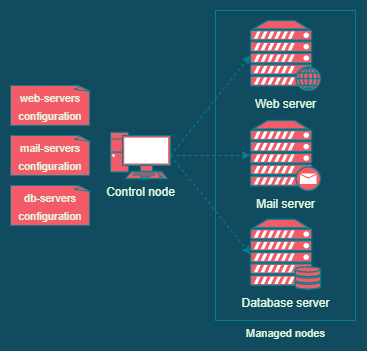

# Basics

## What is Ansible?
Ansible could be defined as a "configuration management tool". From files describing what "state" our systems should be in, Ansible connects via SSH to those systems, pushes small programs called "modules", then implement the changes so the systems meet their desired state. The " machine state" can include installed packages, users, service configuration, ...etc.

<div style="text-align: center;">

</div>

## Installation
[--> Official documentation](https://docs.ansible.com/ansible/latest/installation_guide/intro_installation.html#prerequisites) 

Ansible is *agentless*, meaning it doesn't require an agent to be installed on every host to be configured (except specific modules requirements). To install the `ansible` package to control managed nodes, the control node must be Unix-based.

On the control node:
- The `ansible` package is installed
- SSH keys were generated using `ssh-keygen` and distributed to all the managed nodes
- The `ssh-agent` package is installed and configured using ssh-add to avoid inputting the SSH key password every time Ansible tries to connect to a host.
  ```bash
  ssh-add ~/.ssh/id_rsa
  ```

On the managed node:
- A working SSH and SFTP service (secured with key auth and the control node's public key in `authorized_keys`)
- **Python (>= 3.5)**
- Dependencies for Ansible modules - if needed


## Inventories
[--> Official documentation](https://docs.ansible.com/ansible/latest/user_guide/intro_inventory.html)

Ansible needs to know what hosts it will manage (managed nodes), it is done by defining these hosts in an `INI` or `YAML` file (`/etc/ansible/hosts`).

At their most basic level, inventories can be a simple list of all hosts to be managed. At a more advanced level, it is possible to organize the hosts into several groups so they are applied a different configuration and give them aliases to simplify the playbook. Variables can also be defined and offer more functionalities.

For example, in INI:
```INI
[webservers]
www.example.com
www[2:8].example.com
testing.example.com

[loggingservers]
logging_main ansiblehost=192.168.10.42

[applicationsservers]
apps.example.com

[prod]
www.example.com
www[2:8].example.com
192.168.10.42
apps.example.com

[testing]
testing.example.com
```

The same file in YAML:
```YAML
all:
  children:  # Defines subgroups for the group "all"
    webservers:  # Subgroup called "webservers"
      hosts:
        www.example.com
        www[2:8].example.com
        testing.example.com
    loggingservers:  # Subgroup called "loggingservers"
      hosts:
        logging_main:  # Alias for the host which IP is defined below
          ansible_host: 192.168.10.42
    applicationsservers:  # Subgroup called "applicationsservers"
      hosts:
        apps.example.com
    prod:
      hosts:
        www.example.com
        www[2:8].example.com
        192.168.10.42
        apps.example.com
    testing:
      hosts:
        testing.example.com
```


## Playbook

A playbook is a `YAML` file defining the state of a host or group of hosts. Using modules, we define what to do and on which host/group to do it. The following playbook defines all debian-based hosts as being "updated" (assuming they are in a group called "debian_based"):

```YAML
---
- name: Upgrade Debian-based hosts  # Name of the playbook
  hosts: debian_based  # What host or group this playbook is about
  become: true  # Become root to perform the tasks
  tasks:
    - name: Update repository  # Name of the task
      apt:  # Module
        update_cache: yes  # Action to perform with the module
    - name: Upgrade system
      apt:
        upgrade: full
        state: latest
```

To run the playbook, use the following command. The `--ask-become-pass` option allows ansible to prompt us for the ssh key password.
```bash
ansible-playbook --ask-become-pass /path/to/playbook.yml
```

### Conditionals
[--> Official documentation](https://docs.ansible.com/ansible/latest/user_guide/playbooks_conditionals.html#conditionals-based-on-ansible-facts)

Tasks can be performed wether a condition is met or not with the `when:` instruction:
```YAML
tasks:
  - name: Shut down CentOS 6 and Debian 7 systems
    ansible.builtin.command: /sbin/shutdown -t now
    when: (ansible_facts['distribution'] == "CentOS" and ansible_facts['distribution_major_version'] == "6") or
          (ansible_facts['distribution'] == "Debian" and ansible_facts['distribution_major_version'] == "7")
```

